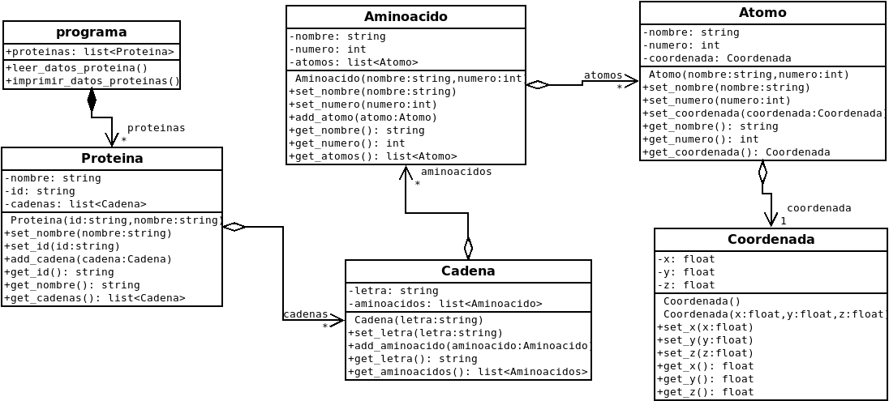

# Assignment Number 0

## Introduction

Implement the following class diagram in `C++`, allowing the user create a list of protein with needed information.



Also,

* For each class create a header and a source file.
* Use Makefile to perform compilation.
* Implement a basic menu.

In addition, keep in mind

* Using some git-based platform, e.g., [github](https://github.com/).
* Class use is mandatory.

## Installation

### Prerequisites

This repo provides you the source files for the program and you'll need a compiler to get the executable. In order to do this, you will need a valid compiler, like `gcc`. There is a pretty good probability that if you're using some GNU/Linux distro, like Arch (I use Arch, btw) or Ubuntu (~~ugh~~) you already have a copy of `gcc` in your system; if isn't your case (a really weird case, btw), you can install it using your distro package manager, e.g., if you're using a debian-based distro (~~ugh~~), you can run `sudo apt-get install build-essential`. I encourage you to install the `manpages-dev` package and invest a little time reading documentation before do whatever you wanna do, to avoid spend time debugging. After my two-cents advice, this program was written and tested on a machine that runs Arch, using `gcc` 11.1.0 under `c++17` standard. Also, if you wanna generate the documentation, you will need `doxygen` (`sudo apt-get install doxygen`) to get it.

### Actual installation

To install this program, you only need to bring this repo to your machine (a.k.a clone the repo). To do that run the next command in your favourite terminal emulator

```
git clone https://github.com/pelafustan/aed_u1g0.git
```

After this tremendous physical and mental effort, you need to run the next command to _actually install_ the thing

```
make
```

If you're a bit bored and you don't have anything better to do with life, you can ~~kill yourself~~ read the documentation of the source files related to this program. In order to generate the docs, you can run

```
make doc
```

This command will generate the documentation and display it in your favourite web browser. You can also view the documentation using `man`. To use `man`, read the `man` documentation.

## Usage

Once you have your clean and shiny executable, you can run it with the next order

```
make run
```

When you run it, the program will ask you for the needed input data.

## Uninstall

To uninstall the program, you can run

```
make clean
```

and all compiled files will be removed from your system. 

After that, you can delete the repo (indeed, you can directly remove the repo, there is no really need to perform the step above).

## Authors

* [J. Patricio Parada G.](https://github.com/pelafustan)

## Acknowledgment

* Black coffee.
* My rubber duck.
* [StackOverflow](https://stackoverflow.com)

## License

No warranties granted about use of this program. This project is under MIT License. See [LICENSE](./LICENSE) for more information.
